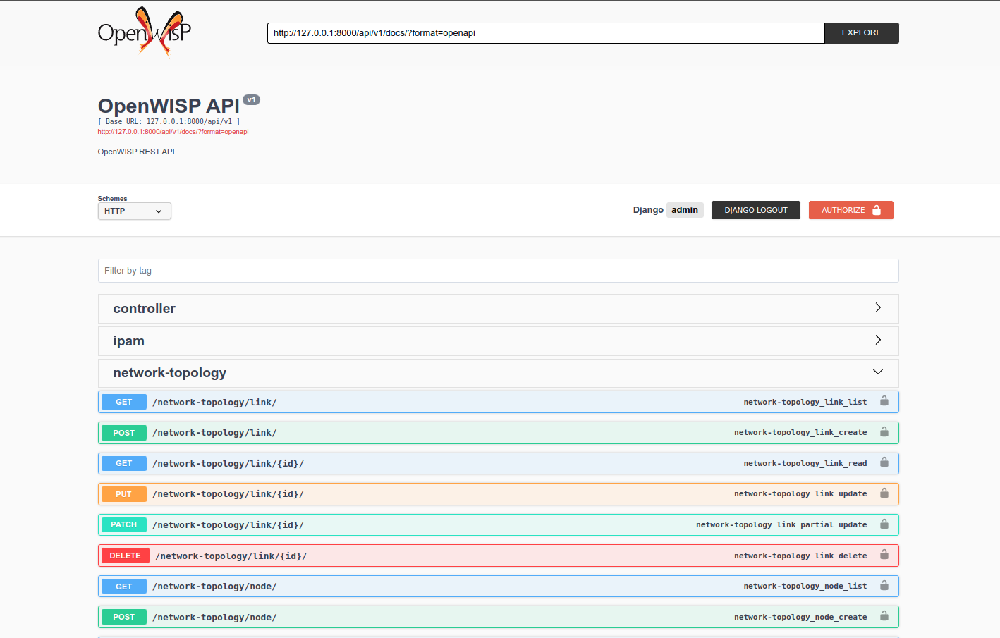
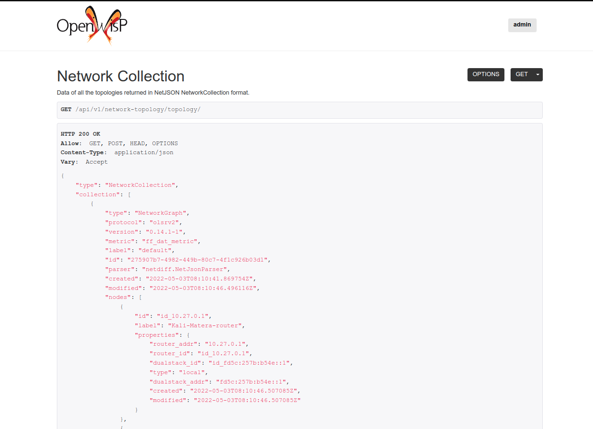

=========================
openwisp-network-topology
=========================

.. image:: https://github.com/openwisp/openwisp-network-topology/workflows/OpenWISP%20Network%20Topology%20CI%20Build/badge.svg?branch=master
   :target: https://github.com/openwisp/openwisp-network-topology/actions?query=OpenWISP+Network+Topology+CI+Build
   :alt: CI build status

.. image:: https://coveralls.io/repos/github/openwisp/openwisp-network-topology/badge.svg
   :target: https://coveralls.io/github/openwisp/openwisp-network-topology
   :alt: Test Coverage

.. image:: https://requires.io/github/openwisp/openwisp-network-topology/requirements.svg?branch=master
   :target: https://requires.io/github/openwisp/openwisp-network-topology/requirements/?branch=master
   :alt: Requirements Status

.. image:: https://img.shields.io/gitter/room/nwjs/nw.js.svg
   :target: https://gitter.im/openwisp/general
   :alt: chat

.. image:: https://badge.fury.io/py/openwisp-network-topology.svg
   :target: http://badge.fury.io/py/openwisp-network-topology
   :alt: Pypi Version

.. image:: https://pepy.tech/badge/openwisp-network-topology
   :target: https://pepy.tech/project/openwisp-network-topology
   :alt: downloads

.. image:: https://img.shields.io/badge/code%20style-black-000000.svg
   :target: https://pypi.org/project/black/
   :alt: code style: black

.. image:: https://github.com/openwisp/openwisp-network-topology/raw/master/docs/demo_network_topology.gif
   :alt: Features Highlights

OpenWISP Network Topology is a network topology collector and visualizer
web application and API, it allows to collect network topology data from different
networking software (dynamic mesh routing protocols, OpenVPN), store it,
visualize it, edit its details, it also provides hooks (a.k.a
`Django signals <https://docs.djangoproject.com/en/3.1/topics/signals/>`_)
to execute code when the status of a link changes.

When used in conjunction with
`OpenWISP Controller <https://github.com/openwisp/openwisp-controller>`_
and
`OpenWISP Monitoring <https://github.com/openwisp/openwisp-monitoring>`_,
it
`makes the monitoring system faster in detecting change to the network <#integration-with-openwisp-controller-and-openwisp-monitoring>`_.

OpenWISP is not only an application designed for end users, but can also be
used as a framework on which custom network automation solutions can be built
on top of its building blocks.

Other popular building blocks that are part of the OpenWISP ecosystem are:

- `openwisp-controller <https://github.com/openwisp/openwisp-controller>`_:
  network and WiFi controller: provisioning, configuration management,
  x509 PKI management and more; works on OpenWRT, but designed to work also on other systems.
- `openwisp-monitoring <https://github.com/openwisp/openwisp-monitoring>`_:
  provides device status monitoring, collection of metrics, charts, alerts,
  possibility to define custom checks
- `openwisp-firmware-upgrader <https://github.com/openwisp/openwisp-firmware-upgrader>`_:
  automated firmware upgrades (single device or mass network upgrades)
- `openwisp-radius <https://github.com/openwisp/openwisp-radius>`_:
  based on FreeRADIUS, allows to implement network access authentication systems like
  802.1x WPA2 Enterprise, captive portal authentication, Hotspot 2.0 (802.11u)
- `openwisp-ipam <https://github.com/openwisp/openwisp-ipam>`_:
  it allows to manage the IP address space of networks

.. image:: https://raw.githubusercontent.com/openwisp/openwisp2-docs/master/assets/design/openwisp-logo-black.svg
  :target: http://openwisp.org
  :alt: OpenWISP

.. contents:: **Table of Contents**:
   :backlinks: none
   :depth: 3

Current features
----------------

* **network topology collector** supporting different formats:
    - NetJSON NetworkGraph
    - OLSR (jsoninfo/txtinfo)
    - batman-adv (jsondoc/txtinfo)
    - BMX6 (q6m)
    - CNML 1.0
    - OpenVPN
    - additional formats can be added by `specifying custom parsers <#netjsongraph-parsers>`_
* **network topology visualizer** based on `netjsongraph.js <https://github.com/openwisp/netjsongraph.js>`_
* **simple HTTP API** that exposes data in `NetJSON <http://netjson.org>`__ *NetworkGraph* format
* **admin interface** that allows to easily manage, audit, visualize and debug topologies and their relative data (nodes, links)
* **receive topology** from multiple nodes
* **topology history**: allows saving daily snapshots of each topology that can be viewed in the frontend
* **faster monitoring**: `integrates with OpenWISP Controller and OpenWISP Monitoring <#integration-with-openwisp-controller-and-openwisp-monitoring>`_
  for faster detection of critical events in the network

Project goals
-------------

* make it easy to visualize network topology data for the formats supported by `netdiff <https://github.com/openwisp/netdiff>`_
* allow standalone usage (without the rest of OpenWISP)
* expose topology data via RESTful resources in *NetJSON NetworkGraph* format
* make it easy to integrate in larger django projects to improve reusability
* make it easy to extend its models by providing abstract models
* provide ways to customize or replace the visualizer (**needs improvement in this point**)
* keep the core very simple
* provide ways to extend the default behaviour
* encourage new features to be published as extensions

Deploy it in production
-----------------------

An automated installer is provided by the `OpenWISP <http://openwisp.org>`_ project:
`ansible-openwisp2 <https://github.com/openwisp/ansible-openwisp2>`_.

Ensure to follow the instructions explained in the following section: `Enabling the network topology
module <https://github.com/openwisp/ansible-openwisp2#enabling-the-network-topology-module>`_.

Install stable version from pypi
--------------------------------

Install from pypi:

.. code-block:: shell

    pip install openwisp-network-topology

Install development version
---------------------------

Install tarball:

.. code-block:: shell

    pip install https://github.com/openwisp/openwisp-network-topology/tarball/master

Alternatively you can install via pip using git:

.. code-block:: shell

    pip install -e git+git://github.com/openwisp/openwisp-network-topology#egg=openwisp-network-topology

If you want to contribute, install your cloned fork:

.. code-block:: shell

    git clone git@github.com:<your_fork>/openwisp-network-topology.git
    cd openwisp-network-topology
    python setup.py develop

Setup (integrate in an existing django project)
-----------------------------------------------

Add ``openwisp_network_topology`` and its dependencies to ``INSTALLED_APPS``:

.. code-block:: python

    INSTALLED_APPS = [
        # other apps
        'openwisp_network_topology',
        'openwisp_users.accounts',
        'allauth',
        'allauth.account',
        'openwisp_users',
        'rest_framework',
    ]

Add the URLs to your main ``urls.py``:

.. code-block:: python

    from django.contrib import admin

    urlpatterns = [
        # ... other urls in your project ...
        url(r'^', include('openwisp_network_topology.urls')),
        url(r'admin/', admin.site.urls),
    ]

Then run:

.. code-block:: shell

    ./manage.py migrate

Installing for development
--------------------------

Install sqlite:

.. code-block:: shell

    sudo apt-get install sqlite3 libsqlite3-dev

Install your forked repo:

.. code-block:: shell

    git clone git://github.com/<your_fork>/openwisp-network-topology
    cd openwisp-network-topology/
    python setup.py develop

Install test requirements:

.. code-block:: shell

    pip install -r requirements-test.txt

Create database:

.. code-block:: shell

    cd tests/
    ./manage.py migrate
    ./manage.py createsuperuser

Set ``EMAIL_PORT`` in ``settings.py`` to a port number (eg: ``1025``):

.. code-block:: python

    EMAIL_PORT = '1025'

Launch development server and SMTP deubgging server:

.. code-block:: shell

    ./manage.py runserver
    # open another session and run
    python -m smtpd -n -c DebuggingServer localhost:1025

You can access the admin interface at http://127.0.0.1:8000/admin/.

Run tests with:

.. code-block:: shell

    ./runtests.py

Run qa tests:

.. code-block:: shell

    ./run-qa-checks

Management Commands
-------------------

``update_topology``
^^^^^^^^^^^^^^^^^^^

After topology URLs (URLs exposing the files that the topology of the network) have been
added in the admin, the ``update_topology`` management command can be used to collect data
and start playing with the network graph::

    ./manage.py update_topology

The management command accepts a ``--label`` argument that will be used to search in
topology labels, eg::

    ./manage.py update_topology --label mytopology

``save_snapshot``
^^^^^^^^^^^^^^^^^

The ``save_snapshot`` management command can be used to save the topology graph data which
could be used to view the network topology graph sometime in future::

    ./manage.py save_snapshot

The management command accepts a ``--label`` argument that will be used to search in
topology labels, eg::

    ./manage.py save_snapshot --label mytopology

``upgrade_from_django_netjsongraph``
^^^^^^^^^^^^^^^^^^^^^^^^^^^^^^^^^^^^

If you are upgrading from django-netjsongraph to openwisp-network-topology, there
is an easy migration script that will import your topologies, users & groups to
openwisp-network-topology instance::

    ./manage.py upgrade_from_django_netjsongraph

The management command accepts an argument ``--backup``, that you can pass
to give the location of the backup files, by default it looks in the ``tests/``
directory, eg::

    ./manage.py upgrade_from_django_netjsongraph --backup /home/user/django_netjsongraph/

The management command accepts another argument ``--organization``, if you want to
import data to a specific organization, you can give its UUID for the same,
by default the data is added to the first found organization, eg::

    ./manage.py upgrade_from_django_netjsongraph --organization 900856da-c89a-412d-8fee-45a9c763ca0b

**Note**: you can follow the `tutorial to migrate database from django-netjsongraph <https://github.com/openwisp/django-netjsongraph/blob/master/README.rst>`_.

``create_device_nodes``
^^^^^^^^^^^^^^^^^^^^^^^

This management command can be used to create the initial ``DeviceNode`` relationships when the
`integration with OpenWISP Controller <#integration-with-openwisp-controller-and-openwisp-monitoring>`_
is enabled in a pre-existing system which already has some devices and topology objects in its database.

.. code-block:: shell

    ./manage.py create_device_nodes

Logging
-------

The ``update_topology`` management command will automatically try to log errors.

For a good default ``LOGGING`` configuration refer to the `test settings
<https://github.com/openwisp/openwisp-network-topology/blob/master/tests/settings.py#L89>`_.

Strategies
----------

There are mainly two ways of collecting topology information:

* **FETCH** strategy
* **RECEIVE** strategy

Each ``Topology`` instance has a ``strategy`` field which can be set to the desired setting.

FETCH strategy
^^^^^^^^^^^^^^

Topology data will be fetched from a URL.

When some links are not detected anymore they will be flagged as "down" straightaway.

RECEIVE strategy
^^^^^^^^^^^^^^^^

Topology data is sent directly from one or more nodes of the network.

The collector waits to receive data in the payload of a POST HTTP request;
when such a request is received, a ``key`` parameter it's first checked against
the ``Topology`` key.

If the request is authorized the collector proceeds to update the topology.

If the data is sent from one node only, it's highly advised to set the
``expiration_time`` of the ``Topology`` instance to ``0`` (seconds), this way the
system works just like in the **FETCH strategy**, with the only difference that
the data is sent by one node instead of fetched by the collector.

If the data is sent from multiple nodes, you **SHOULD** set the ``expiration_time``
of the ``Topology`` instance to a value slightly higher than the interval used
by nodes to send the topology, this way links will be flagged as "down" only if
they haven't been detected for a while. This mechanism allows to visualize the
topology even if the network has been split in several parts, the disadvantage
is that it will take a bit more time to detect links that go offline.

Integration with OpenWISP Controller and OpenWISP Monitoring
------------------------------------------------------------

If you use `OpenWISP Controller <https://github.com/openwisp/openwisp-controller>`_
or `OpenWISP Monitoring <https://github.com/openwisp/openwisp-monitoring>`_
and you use OpenVPN for the management VPN, you can use the integration available in
``openwisp_network_topology.integrations.device``.

This additional and optional module provides the following features:

- whenever the stauts of an OpenVPN link changes:

  - the management IP address of the related device is updated straightaway
  - if OpenWISP Monitoring is enabled, the device checks are triggered (e.g.: ping)

This integration makes the whole system a lot faster in detecting important events in the network.

In order to use this module simply add
``openwisp_network_topology.integrations.device`` to ``INSTALLED_APPS``:

.. code-block:: python

    INSTALLED_APPS = [
        # other apps (eg: openwisp-controller, openwisp-monitoring)
        'openwisp_network_topology',
        'openwisp_network_topology.integrations.device',
        'openwisp_users.accounts',
        'allauth',
        'allauth.account',
        'openwisp_users',
        'rest_framework',
    ]

If you are enabling this integration on a pre-existing system, use the
`create_device_nodes <#create-device-nodes>`_ management command to create
the relationship between devices and nodes.

Settings
--------

``OPENWISP_NETWORK_TOPOLOGY_PARSERS``
^^^^^^^^^^^^^^^^^^^^^^^^^^^^^^^^^^^^^

+--------------+-------------+
| **type**:    | ``list``    |
+--------------+-------------+
| **default**: | ``[]``      |
+--------------+-------------+

Additional custom `netdiff parsers <https://github.com/openwisp/netdiff#parsers>`_.

``OPENWISP_NETWORK_TOPOLOGY_SIGNALS``
^^^^^^^^^^^^^^^^^^^^^^^^^^^^^^^^^^^^^

+--------------+-------------+
| **type**:    | ``str``     |
+--------------+-------------+
| **default**: | ``None``    |
+--------------+-------------+

String representing python module to import on initialization.

Useful for loading django signals or to define custom behaviour.

``OPENWISP_NETWORK_TOPOLOGY_TIMEOUT``
^^^^^^^^^^^^^^^^^^^^^^^^^^^^^^^^^^^^^

+--------------+-------------+
| **type**:    | ``int``     |
+--------------+-------------+
| **default**: | ``8``       |
+--------------+-------------+

Timeout when fetching topology URLs.

``OPENWISP_NETWORK_TOPOLOGY_LINK_EXPIRATION``
^^^^^^^^^^^^^^^^^^^^^^^^^^^^^^^^^^^^^^^^^^^^^

+--------------+-------------+
| **type**:    | ``int``     |
+--------------+-------------+
| **default**: | ``60``      |
+--------------+-------------+

If a link is down for more days than this number, it will be deleted by the
``update_topology`` management command.

Setting this to ``False`` will disable this feature.

``OPENWISP_NETWORK_TOPOLOGY_VISUALIZER_CSS``
^^^^^^^^^^^^^^^^^^^^^^^^^^^^^^^^^^^^^^^^^^^^

+--------------+--------------------------------+
| **type**:    | ``str``                        |
+--------------+--------------------------------+
| **default**: | ``netjsongraph/css/style.css`` |
+--------------+--------------------------------+

Path of the visualizer css file. Allows customization of css according to user's
preferences.

``OPENWISP_NETWORK_TOPOLOGY_NODE_EXPIRATION``
^^^^^^^^^^^^^^^^^^^^^^^^^^^^^^^^^^^^^^^^^^^^^

+--------------+--------------------------------+
| **type**:    | ``int``                        |
+--------------+--------------------------------+
| **default**: | ``False``                      |
+--------------+--------------------------------+

If a node has not been modified since the days specified and if it has no links,
it will be deleted by the ``update_topology`` management command. This depends on
``OPENWISP_NETWORK_TOPOLOGY_LINK_EXPIRATION`` being enabled.
Replace ``False`` with an integer to enable the feature.

``OPENWISP_NETWORK_TOPOLOGY_API_URLCONF``
^^^^^^^^^^^^^^^^^^^^^^^^^^^^^^^^^^^^^^^^^

+--------------+---------------+
| **type**:    |   ``string``  |
+--------------+---------------+
| **default**: |   ``None``    |
+--------------+---------------+

Use the ``urlconf`` option to change receive api url to point to
another module, example, ``myapp.urls``.

``OPENWISP_NETWORK_TOPOLOGY_API_BASEURL``
^^^^^^^^^^^^^^^^^^^^^^^^^^^^^^^^^^^^^^^^^

+--------------+---------------+
| **type**:    |   ``string``  |
+--------------+---------------+
| **default**: |   ``None``    |
+--------------+---------------+

If you have a seperate instance of openwisp-network-topology on a
different domain, you can use this option to change the base
of the url, this will enable you to point all the API urls to
your openwisp-network-topology API server's domain,
example value: ``https://mytopology.myapp.com``.

``OPENWISP_NETWORK_TOPOLOGY_API_AUTH_REQUIRED``
^^^^^^^^^^^^^^^^^^^^^^^^^^^^^^^^^^^^^^^^^^^^^^^

+--------------+---------------+
| **type**:    |   ``boolean`` |
+--------------+---------------+
| **default**: |   ``True``    |
+--------------+---------------+

When enabled, the API `endpoints <#list-of-endpoints>`_ will only allow authenticated users
who have the necessary permissions to access the objects which
belong to the organizations the user manages.

Rest API
--------

Live documentation
^^^^^^^^^^^^^^^^^^

A general live API documentation (following the OpenAPI specification) at ``/api/v1/docs/``.

Browsable web interface
^^^^^^^^^^^^^^^^^^^^^^^

Additionally, opening any of the endpoints `listed below <#list-of-endpoints>`_
directly in the browser will show the `browsable API interface of Django-REST-Framework
<https://www.django-rest-framework.org/topics/browsable-api/>`_,
which makes it even easier to find out the details of each endpoint.

List of endpoints
^^^^^^^^^^^^^^^^^

Since the detailed explanation is contained in the `Live documentation <#live-documentation>`_
and in the `Browsable web page <#browsable-web-interface>`_ of each point,
here we'll provide just a list of the available endpoints,
for further information please open the URL of the endpoint in your browser.

List topologies
###############

.. code-block:: text

    GET /api/v1/topology/topology/

Create topology
###############

.. code-block:: text

    POST /api/v1/topology/topology/

Detail of a topology
####################

.. code-block:: text

    GET /api/v1/topology/topology/{id}/

Change topolgy detail
#####################

.. code-block:: text

    PUT /api/v1/topology/topology/{id}/

Patch topology detail
#####################

.. code-block:: text

    PATCH /api/v1/topology/topology/{id}/

Delete topology
###############

.. code-block:: text

    DELETE /api/v1/topology/topology/{id}/

View topology history
#####################

This endpoint is used to go back in time to view previous topology snapshots.
For it to work, snapshots need to be saved periodically as described in
`save_snapshot <#save-snapshot>`_ section above.

For example, we could use the endpoint to view the snapshot of a topology
saved on ``2020-08-08`` as follows.

.. code-block:: text

    GET /api/v1/topology/topology/{id}/history/?date=2020-08-08

Send topology data
##################

.. code-block:: text

    POST /api/v1/topology/topology/{id}/receive/

List links
##########

.. code-block:: text

    GET /api/v1/topology/link/

Create link
###########

.. code-block:: text

    POST /api/v1/topology/link/

Get link detail
###############

.. code-block:: text

    GET /api/v1/topology/link/{id}/

Change link detail
##################

.. code-block:: text

    PUT /api/v1/topology/link/{id}/

Patch link detail
#################

.. code-block:: text

    PATCH /api/v1/topology/link/{id}/

Delete link
###########

.. code-block:: text

    DELETE /api/v1/topology/link/{id}/

List nodes
##########

.. code-block:: text

    GET /api/v1/topology/node/

Create node
###########

.. code-block:: text

    POST /api/v1/topology/node/

Get node detail
###############

.. code-block:: text

    GET /api/v1/topology/node/{id}/

Change node detail
##################

.. code-block:: text

    PUT /api/v1/topology/node/{id}/

Patch node detail
#################

.. code-block:: text

    PATCH /api/v1/topology/node/{id}/

Delete node
###########

.. code-block:: text

    DELETE /api/v1/topology/node/{id}/

Overriding visualizer templates
-------------------------------

Follow these steps to override and customise the visualizer's default templates:

* create a directory in your django project and put its full path in ``TEMPLATES['DIRS']``,
  which can be found in the django ``settings.py`` file
* create a sub directory named ``netjsongraph`` and add all the templates which shall override
  the default ``netjsongraph/*`` templates
* create a template file with the same name of the template file you want to override

More information about the syntax used in django templates can be found in the `django templates
documentation <https://docs.djangoproject.com/en/dev/ref/templates/>`_.

Example: overriding the ``

Extending openwisp-network-topology
-----------------------------------

One of the core values of the OpenWISP project is `Software Reusability <http://openwisp.io/docs/general/values.html#software-reusability-means-long-term-sustainability>`_,
for this reason *openwisp-network-topology* provides a set of base classes
which can be imported, extended and reused to create derivative apps.

In order to implement your custom version of *openwisp-network-topology*,
you need to perform the steps described in this section.

When in doubt, the code in the `test project <https://github.com/openwisp/openwisp-network-topology/tree/master/tests/openwisp2/>`_
and the `sample app <https://github.com/openwisp/openwisp-network-topology/tree/master/tests/openwisp2/sample_network_topology/>`_
will serve you as source of truth:
just replicate and adapt that code to get a basic derivative of
*openwisp-network-topology* working.

**Premise**: if you plan on using a customized version of this module,
we suggest to start with it since the beginning, because migrating your data
from the default module to your extended version may be time consuming.

1. Initialize your custom module
^^^^^^^^^^^^^^^^^^^^^^^^^^^^^^^^

The first thing you need to do is to create a new django app which will
contain your custom version of *openwisp-network-topology*.

A django app is nothing more than a
`python package <https://docs.python.org/3/tutorial/modules.html#packages>`_
(a directory of python scripts), in the following examples we'll call this django app
``sample_network_topology``, but you can name it how you want::

    django-admin startapp sample_network_topology

If you use the integration with openwisp-controller, you may want to extend also the
integration app if you need::

    django-admin startapp sample_integration_device

Keep in mind that the command mentioned above must be called from a directory
which is available in your `PYTHON_PATH <https://docs.python.org/3/using/cmdline.html#envvar-PYTHONPATH>`_
so that you can then import the result into your project.

Now you need to add ``sample_network_topology`` to ``INSTALLED_APPS`` in your ``settings.py``,
ensuring also that ``openwisp_network_topology`` has been removed:

.. code-block:: python

    INSTALLED_APPS = [
        # ... other apps ...
        'openwisp_utils.admin_theme',
        # all-auth
        'django.contrib.sites',
        'openwisp_users.accounts',
        'allauth',
        'allauth.account',
        'allauth.socialaccount',
        # (optional) openwisp_controller - required only if you are using the integration app
        'openwisp_controller.pki',
        'openwisp_controller.config',
        'reversion',
        'sortedm2m',
        # network topology
        # 'sample_network_topology' <-- uncomment and replace with your app-name here
        # (optional) required only if you need to extend the integration app
        # 'sample_integration_device' <-- uncomment and replace with your integration-app-name here
        'openwisp_users',
        # admin
        'django.contrib.admin',
        # rest framework
        'rest_framework',
    ]

For more information about how to work with django projects and django apps,
please refer to the `django documentation <https://docs.djangoproject.com/en/dev/intro/tutorial01/>`_.

2. Install ``openwisp-network-topology``
^^^^^^^^^^^^^^^^^^^^^^^^^^^^^^^^^^^^^^^^

Install (and add to the requirement of your project) openwisp-network-topology::

    pip install openwisp-network-topology

3. Add ``EXTENDED_APPS``
^^^^^^^^^^^^^^^^^^^^^^^^

Add the following to your ``settings.py``:

.. code-block:: python

    EXTENDED_APPS = ('openwisp_network_topology',)

4. Add ``openwisp_utils.staticfiles.DependencyFinder``
^^^^^^^^^^^^^^^^^^^^^^^^^^^^^^^^^^^^^^^^^^^^^^^^^^^^^^

Add ``openwisp_utils.staticfiles.DependencyFinder`` to
``STATICFILES_FINDERS`` in your ``settings.py``:

.. code-block:: python

    STATICFILES_FINDERS = [
        'django.contrib.staticfiles.finders.FileSystemFinder',
        'django.contrib.staticfiles.finders.AppDirectoriesFinder',
        'openwisp_utils.staticfiles.DependencyFinder',
    ]

5. Add ``openwisp_utils.loaders.DependencyLoader``
^^^^^^^^^^^^^^^^^^^^^^^^^^^^^^^^^^^^^^^^^^^^^^^^^^

Add ``openwisp_utils.loaders.DependencyLoader`` to ``TEMPLATES`` in your ``settings.py``:

.. code-block:: python

    TEMPLATES = [
        {
            'BACKEND': 'django.template.backends.django.DjangoTemplates',
            'OPTIONS': {
                'loaders': [
                    'django.template.loaders.filesystem.Loader',
                    'django.template.loaders.app_directories.Loader',
                    'openwisp_utils.loaders.DependencyLoader',
                ],
                'context_processors': [
                    'django.template.context_processors.debug',
                    'django.template.context_processors.request',
                    'django.contrib.auth.context_processors.auth',
                    'django.contrib.messages.context_processors.messages',
                ],
            },
        }
    ]

6. Inherit the AppConfig class
^^^^^^^^^^^^^^^^^^^^^^^^^^^^^^

Please refer to the following files in the sample app of the test project:

- `sample_network_topology/__init__.py <https://github.com/openwisp/openwisp-network-topology/tree/master/tests/openwisp2/sample_network_topology/__init__.py>`_.
- `sample_network_topology/apps.py <https://github.com/openwisp/openwisp-network-topology/tree/master/tests/openwisp2/sample_network_topology/apps.py>`_.

For the integration with openwisp-controller, see:

- `sample_integration_device/__init__.py <https://github.com/openwisp/openwisp-network-topology/tree/master/tests/openwisp2/sample_integration_device/__init__.py>`_.
- `sample_integration_device/apps.py <https://github.com/openwisp/openwisp-network-topology/tree/master/tests/openwisp2/sample_integration_device/apps.py>`_.

You have to replicate and adapt that code in your project.

For more information regarding the concept of ``AppConfig`` please refer to
the `"Applications" section in the django documentation <https://docs.djangoproject.com/en/dev/ref/applications/>`_.

7. Create your custom models
^^^^^^^^^^^^^^^^^^^^^^^^^^^^

Please refer to `sample_app models file <https://github.com/openwisp/openwisp-network-topology/tree/master/tests/openwisp2/sample_network_topology/models.py>`_
use in the test project.

You have to replicate and adapt that code in your project.

**Note**: for doubts regarding how to use, extend or develop models please refer to
the `"Models" section in the django documentation <https://docs.djangoproject.com/en/dev/topics/db/models/>`_.

8. Add swapper configurations
^^^^^^^^^^^^^^^^^^^^^^^^^^^^^

Once you have created the models, add the following to your ``settings.py``:

.. code-block:: python

    # Setting models for swapper module
    TOPOLOGY_LINK_MODEL = 'sample_network_topology.Link'
    TOPOLOGY_NODE_MODEL = 'sample_network_topology.Node'
    TOPOLOGY_SNAPSHOT_MODEL = 'sample_network_topology.Snapshot'
    TOPOLOGY_TOPOLOGY_MODEL = 'sample_network_topology.Topology'
    # if you use the integration with OpenWISP Controller and/or OpenWISP Monitoring
    TOPOLOGY_DEVICE_DEVICENODE_MODEL = 'sample_integration_device.DeviceNode'

Substitute ``sample_network_topology`` with the name you chose in step 1.

9. Create database migrations
^^^^^^^^^^^^^^^^^^^^^^^^^^^^^

Create and apply database migrations::

    ./manage.py makemigrations
    ./manage.py migrate

For more information, refer to the
`"Migrations" section in the django documentation <https://docs.djangoproject.com/en/dev/topics/migrations/>`_.

10. Create the admin
^^^^^^^^^^^^^^^^^^^^

Refer to the `admin.py file of the sample app <https://github.com/openwisp/openwisp-network-topology/tree/master/tests/openwisp2/sample_network_topology/admin.py>`_.

To introduce changes to the admin, you can do it in two main ways which are described below.

**Note**: for more information regarding how the django admin works, or how it can be customized,
please refer to `"The django admin site" section in the django documentation <https://docs.djangoproject.com/en/dev/ref/contrib/admin/>`_.

1. Monkey patching
##################

If the changes you need to add are relatively small, you can resort to monkey patching.

For example:

.. code-block:: python

    from openwisp_network_topology.admin import TopologyAdmin, LinkAdmin, NodeAdmin

    # TopologyAdmin.list_display.insert(1, 'my_custom_field') <-- your custom change example
    # LinkAdmin.list_display.insert(1, 'my_custom_field') <-- your custom change example
    # NodeAdmin.list_display.insert(1, 'my_custom_field') <-- your custom change example

2. Inheriting admin classes
###########################

If you need to introduce significant changes and/or you don't want to resort to
monkey patching, you can proceed as follows:

.. code-block:: python

    from django.contrib import admin
    from swapper import load_model

    from openwisp_network_topology.admin import (
        TopologyAdmin as BaseTopologyAdmin,
        LinkAdmin as BaseLinkAdmin,
        NodeAdmin as BaseNodeAdmin
    )

    Node = load_model('topology', 'Node')
    Link = load_model('topology', 'Link')
    Topology = load_model('topology', 'Topology')

    admin.site.unregister(Topology)
    admin.site.unregister(Link)
    admin.site.unregister(Node)

    @admin.register(Topology, TopologyAdmin)
    class TopologyAdmin(BaseTopologyAdmin):
        # add your changes here

    @admin.register(Link, LinkAdmin)
    class LinkAdmin(BaseLinkAdmin):
        # add your changes here

    @admin.register(Node, NodeAdmin)
    class NodeAdmin(BaseNodeAdmin):
        # add your changes here

11. Create root URL configuration
^^^^^^^^^^^^^^^^^^^^^^^^^^^^^^^^^

Please read and replicate according to your project needs:

.. code-block:: python

    The following can be used to register all the urls in your
    ``urls.py``.

    # If you've extended visualizer views (discussed below).
    # Import visualizer views & function to add it.
    # from openwisp_network_topology.utils import get_visualizer_urls
    # from .sample_network_topology.visualizer import views

    urlpatterns = [
        # If you've extended visualizer views (discussed below).
        # Add visualizer views in urls.py
        # url(r'^topology/', include(get_visualizer_urls(views))),
        url(r'^', include('openwisp_network_topology.urls')),
        url(r'^admin/', admin.site.urls),
    ]

For more information about URL configuration in django, please refer to the
`"URL dispatcher" section in the django documentation <https://docs.djangoproject.com/en/dev/topics/http/urls/>`_.

12. Setup API urls
^^^^^^^^^^^^^^^^^^

You need to create a file ``api/urls.py`` (the name & path of the file must match)
inside your app, which contains the following:

.. code-block:: python

    from openwisp_network_topology.api import views
    # When you want to modify views, please change views location
    # from . import views
    from openwisp_network_topology.utils import get_api_urls

    urlpatterns = get_api_urls(views)

13. Extending management commands
^^^^^^^^^^^^^^^^^^^^^^^^^^^^^^^^^

To extend the management commands, create `sample_network_topology/management/commands` directory and
two files in it:

- `save_snapshot.py <https://github.com/openwisp/openwisp-network-topology/tree/master/tests/openwisp2/sample_network_topology/management/commands/save_snapshot.py>`_
- `update_topology.py <https://github.com/openwisp/openwisp-network-topology/tree/master/tests/openwisp2/sample_network_topology/management/commands/update_topology.py>`_

14. Import the automated tests
^^^^^^^^^^^^^^^^^^^^^^^^^^^^^^

When developing a custom application based on this module, it's a good
idea to import and run the base tests too, so that you can be sure the changes
you're introducing are not breaking some of the existing features of *openwisp-network-topology*.

Refer to the `tests.py file of the sample app <https://github.com/openwisp/openwisp-network-topology/tree/master/tests/openwisp2/sample_network_topology/tests.py>`_.

In case you need to add breaking changes, you can overwrite the tests defined
in the base classes to test your own behavior.

For testing you also need to extend the fixtures, you can copy the
file ``openwisp_network_topology/fixtures/test_users.json`` in your sample app's
``fixtures/`` directory.

Now, you can then run tests with::

    # the --parallel flag is optional
    ./manage.py test --parallel sample_network_topology

Substitute ``sample_network_topology`` with the name you chose in step 1.

For more information about automated tests in django, please refer to
`"Testing in Django" <https://docs.djangoproject.com/en/dev/topics/testing/>`_.

Other base classes that can be inherited and extended
^^^^^^^^^^^^^^^^^^^^^^^^^^^^^^^^^^^^^^^^^^^^^^^^^^^^^^

The following steps are not required and are intended for more advanced customization.

1. Extending API views
######################

Extending the views is only required when you want to make changes in the
behaviour of the API.
Please refer to `sample_network_topology/api/views.py
<https://github.com/openwisp/openwisp-network-topology/tree/master/tests/openwisp2/sample_network_topology/api/views.py>`_
and replicate it in your application.

If you extend these views, remember to use these views in the
``api/urls.py``.

2. Extending the Visualizer views
#################################

Similar to API views, visualizer views are only required to be extended
when you want to make changes in the Visualizer.
Please refer to `sample_network_topology/visualizer/views.py
<https://github.com/openwisp/openwisp-network-topology/tree/master/tests/openwisp2/sample_network_topology/visualizer/views.py>`_
and replicate it in your application.

If you extend these views, remember to use these views in the ``urls.py``.

Contributing
------------

Please refer to the `OpenWISP contributing guidelines <http://openwisp.io/docs/developer/contributing.html>`_.

Changelog
---------

See `CHANGES <https://github.com/openwisp/openwisp-network-topology/blob/master/CHANGES.rst>`_.

License
-------

See `LICENSE <https://github.com/openwisp/openwisp-network-topology/blob/master/LICENSE>`_.

This projects bundles third-party javascript libraries in its source code:

- `D3.js (BSD-3-Clause) <https://d3js.org/>`_

Support
-------

See `OpenWISP Support Channels <http://openwisp.org/support.html>`_.
