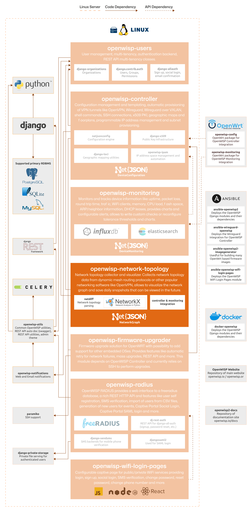

Network Topology
================

.. seealso::

    **Source code**: `github.com/openwisp/openwisp-network-topology
    <https://github.com/openwisp/openwisp-network-topology>`_.

OpenWISP Network Topology is a network topology collector and visualizer
web application and API, it allows to collect network topology data from
different networking software (dynamic mesh routing protocols, OpenVPN),
store it, visualize it, edit its details, it also provides hooks (a.k.a
`Django signals <https://docs.djangoproject.com/en/4.2/topics/signals/>`_)
to execute code when the status of a link changes.

When used in conjunction with :doc:`OpenWISP Controller
</controller/index>` and :doc:`OpenWISP Monitoring </monitoring/index>`,
it :doc:`makes the monitoring system faster in detecting change to the
network <./user/integrations>`.

For a comprehensive overview of features, please refer to the
:doc:`user/intro` page.

The following diagram illustrates the role of the Network Topology module
within the OpenWISP architecture.

    **OpenWISP Architecture: highlighted network topology module**

.. important::

    For an enhanced viewing experience, open the image above in a new
    browser tab.

    Refer to :doc:`/general/architecture` for more information.

.. toctree::
    :caption: Network Topology Usage Docs
    :maxdepth: 1

    ./user/intro.rst
    ./user/quickstart.rst
    ./user/strategies.rst
    ./user/integrations.rst
    ./user/rest-api.rst
    ./user/settings.rst
    ./user/management-commands.rst

.. toctree::
    :caption: Network Topology Developer Docs
    :maxdepth: 2

    Developer Docs Index <developer/index.rst>
